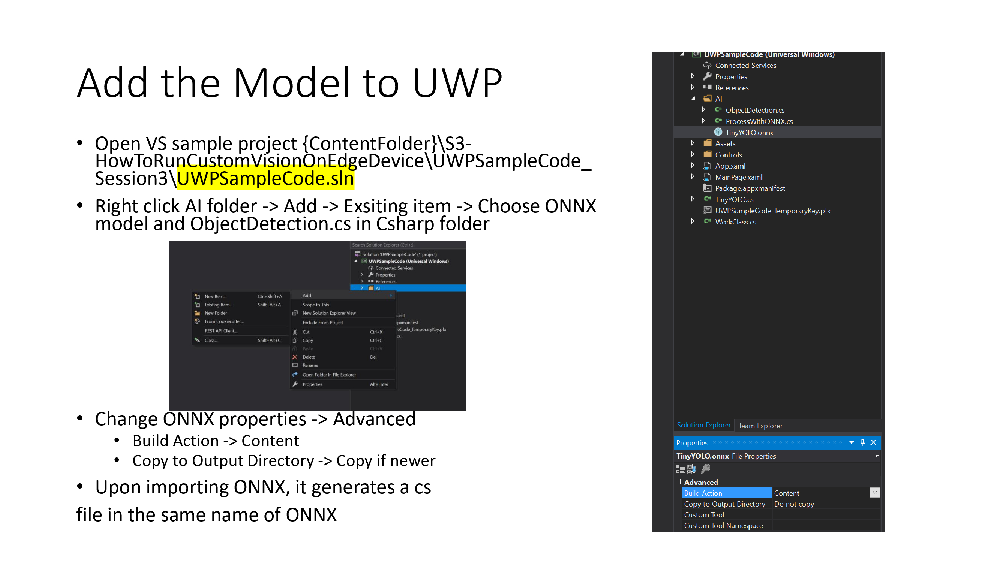
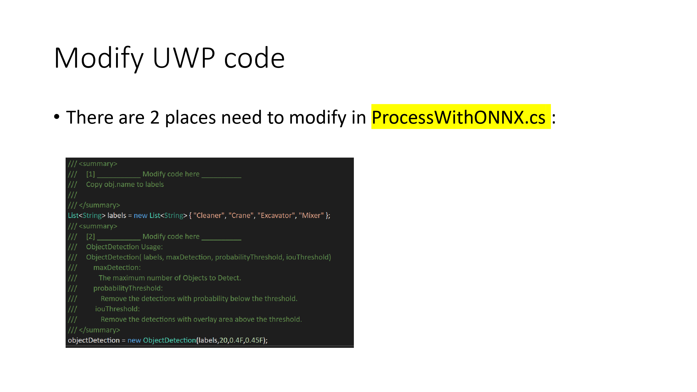
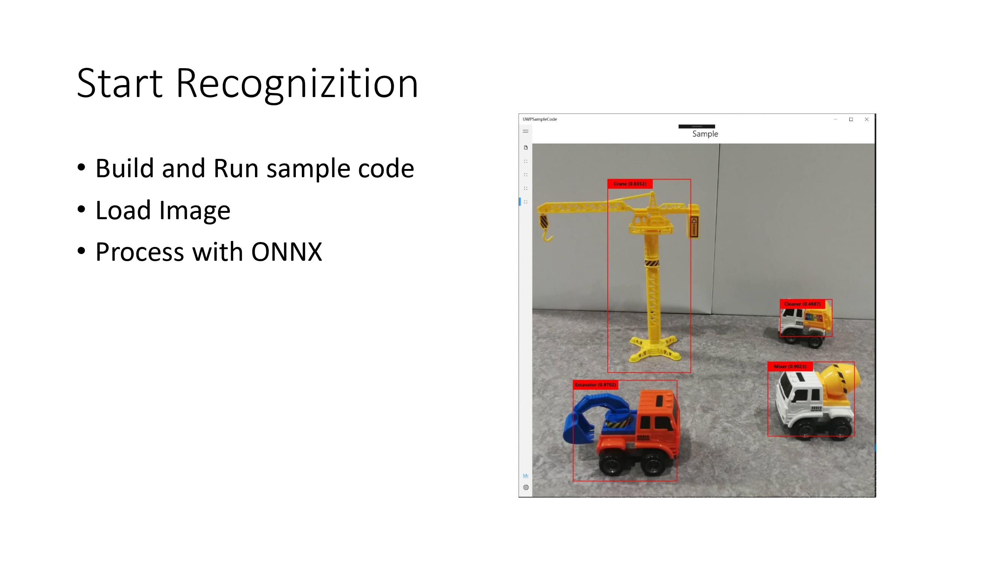

This folder stores the sample code the competition provide us. Follow the instructions below to setup an ONNX model to the C# program. This program establishes connection to a DJI drone that supports [Windows SDK](https://github.com/dji-sdk/Windows-SDK), loads up the ONNX model provided and perform inference on camera feed. One will need VS2015+ to build this project.

